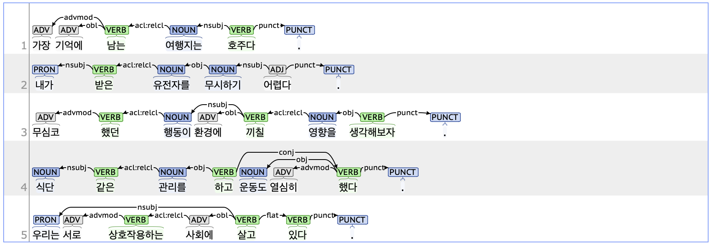

## acl: Clausal modifier of noun

### Definition
`acl` refers to a clause that modifies a noun within a sentence.

---

### Characteristics
- The acl tag is a type of clause that, unlike a sentence, cannot function independently. It acts as a modifier of a noun within a sentence.
- The acl tag typically includes ETM (Ending Determinitive, 관형형 전성 어미), such as '-는', '-ㄴ', '-던', '-ㄹ', and '-을' combined with verbs or adjectives.
- **Examples**:
    - 내 기억에 <ins>**남는**</ins> 여행지는 호주다.
    - 부모님께 <ins>**받은**</ins> 유전자를 무시하기 어렵다.
    - 무심코 <ins>**했던**</ins> 행동이 환경에 <ins>**끼칠**</ins> 영향을 생각해보자.
    - 식단 <ins>**같은**</ins> 관리는 하지 않고 운동을 열심히 했다.

---

### Boundary cases and clarifications

#### Differences with related tags

- **acl vs. amod (Adjectival modifier):**  
  Both the acl and amod tags function as noun modifiers within a sentence. The acl tag refers to a predicate that leads a clause distinct from the root of the sentence, while the amod tag refers to a word that is itself an adjective or determiner.
    - **acl**: 우리는 서로 <ins>**상호작용하는**</ins> 사회에 살고 있다.
    - **amod**: 누구나 <ins>**다른**</ins> 사람들과 상호작용한다.

#### Special cases
- **Modal expressions using '-ㄹ/을 수 있다' and '-ㄹ/을 것이다'**:  
    - Both are Korean modal expressions indicating possibility. '수' and '것' are classified as NNB (Noun_common_bound, 의존 명사), while '-ㄹ/을' is parsed as acl because it modifies '수' or '것'.
        - 연습할수록 자신감이 <ins>**붙을**</ins> 겁니다.
        - 운동하면 너가 <ins>**좋아하는**</ins> 음식을 <ins>**먹을**</ins> 수 있다.

---

### Examples

The `acl:relcl` tag is standardized as the `acl` tag.
