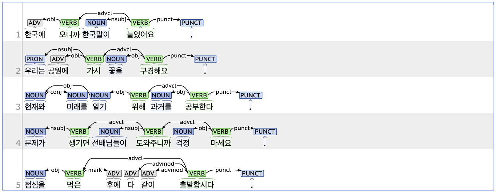

## advcl: Adverbial clause modifier

### Definition
`advcl` refers to an adverbial clause that depends on a main clause to modify a predicate or sentence.

---

### Characteristics
- The advcl tag refers to the predicate of a subordinate clause within a sentence. It provides information such as reason, condition, purpose, or concession regarding the predicate of another clause or the root of the sentence.
- The advcl tag typically includes EC (Ending_Connecting, 연결 어미) such as '-아/어서', '-(니)까', '-(으)면', '-(으)러', and '-(으)려고'.
- **Examples**:
    - 한국에 <ins>**오니까**</ins> 한국말이 늘었어요.
    - 우리는 공원에 <ins>**가서**</ins> 꽃을 구경해요.
    - 현재와 미래를 알기 <ins>**위해**</ins> 과거를 공부한다.
    - 문제가 <ins>**생기면**</ins> 선배님들이 <ins>**도와주니까**</ins> 걱정 마세요.

---

### Boundary cases and clarifications
#### Differences with related tags
- **advcl vs. conj (Conjunct):**  
  - Both the advcl and conj tags are used to parse sentences with multiple clauses. However, advcl depends semantically on the predicate of another clause or the root of the sentence. In contrast, conj indicates a predicate that is semantically coordinate with the preceding clause or root, often expressing sequence or contrast.
    - **advcl**: 부산까지 기차로 <ins>**가면**</ins> 비행기보다 **싸다** (root).
    - **conj**: 부산까지 기차로 **가고** (root) 거기에서 비행기로 <ins>**갈아탄다**</ins>.

#### Special cases
- **The syntactic structure of 'advcl + mark':**
    - The marker is a function word that makes one clause subordinate to another, typically following the advcl.
    - In the advcl + mark structure, the advcl usually contains an ETM (Ending_Determinitive, 관형형 전성 어미). From a morphological perspective, the verb or adjective in the advcl modifies the noun in the mark. From a syntactic perspective, the mark tag serves a grammatical function that allows the advcl to subordinate to another clause.
        - 점심을 **먹은**(advcl) **후에**(mark) 다 같이 출발합시다.
        - 저는 **어렸을**(advcl) **때부터**(mark) 피아니스트가 되고 싶었습니다.

---

### Examples

