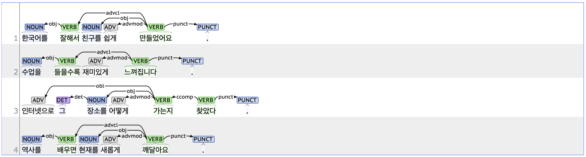

## advmod: Adverbial modifier

### Definition
`advmod` refers to adverbial modifiers that modify verbs, adjectives, and other modifier words.

---

### Characteristics
- From a part-of-speech perspective, advmod generally includes standalone adverbs or verbs and adjectives ending with the suffix '-게'.
- The advmod tag provides additional information regarding the manner, frequency, intensity, or degree of verbs, adjectives, and other sentence elements.
- **Examples**:
    - 한국어를 <ins>**매우**</ins> 잘하면 친구를 <ins>**쉽게**</ins> 만들 수 있습니다.
    - 수업을 <ins>**열심히**</ins> 들을수록 공부가 <ins>**재미있게**</ins> 느껴집니다.
    - 인터넷으로 그 장소를 <ins>**어떻게**</ins> 가는지 찾았다. 

---

### Boundary cases and clarifications
#### Differences with related tags
- **advmod vs. advcl (adverbial clause modifier):**  
  - Both the advmod and advcl tags can modify verbs or adjectives when combined with '-게', an EC (ending_connecting, 연결 어미).Unlike advmod, elements tagged as advcl can lead a clause.
  - When an adjective is combined with '-게', it is typically parsed as an advmod tag. In contrast, when a verb is combined with '-게', it is usually parsed as an advcl tag, where preceding words can act as the subject or object of the clause.
    - 역사를 <ins>**배우게**</ins>(advcl) 되면 <ins>**새롭게**</ins>(advmod) 깨닫는 내용이 많다.
    - 한국어를 <ins>**자연스럽게**</ins>(advmod) 접하다보면 자기도 <ins>**모르게**</ins>(advcl) 익숙해집니다.

#### Special cases
- **Ungrammatical sentences:**  
  - For ungrammatical sentences, if a sentence element cannot be determined based on postpositions or context, it should be parsed as advmod and treated as dependent on the root. This ensures parsing consistency for elements with unclear meaning or function.
    - 한국에 <ins>**저움**</ins> 가볼 계획이 있으세요?
    - 그 이야기는 <ins>**오후**</ins> <ins>**진짜**</ins> 슬픈 기분입니다.

---

### Examples
