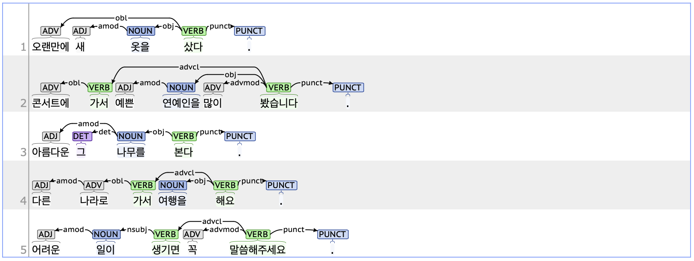

## amod: Adjectival modifier

### Definition
`amod` refers to words that function as determiners or adjectives to modify nouns.

---

### Characteristics
- The amod tag generally modifies a following noun and is semantically dependent on the noun it modifies.
- The amod tag typically includes MM (Determiner, 관형사) or VA (Adjective, 형용사). 
- **Examples**:
    - 오랜만에 <ins>**새**</ins> 옷을 샀다.
    - 콘서트에 가서 <ins>**예쁜**</ins> 연예인을 많이 봤습니다.

---

### Boundary cases and clarifications
#### Differences with related tags
- **amod vs. det (Determiner):**  
  - Both amod and det limit the meaning of the following noun. In terms of part of speech, amod consists of determiners or adjectives that describe the appearance, state, or quality of a noun, while det generally consists of demonstrative determiners.  
    - **amod**: <ins>**아름다운**</ins> 나무를 본다.  
    - **det**: <ins>**그**</ins> 나무를 본다.

---

### Examples
