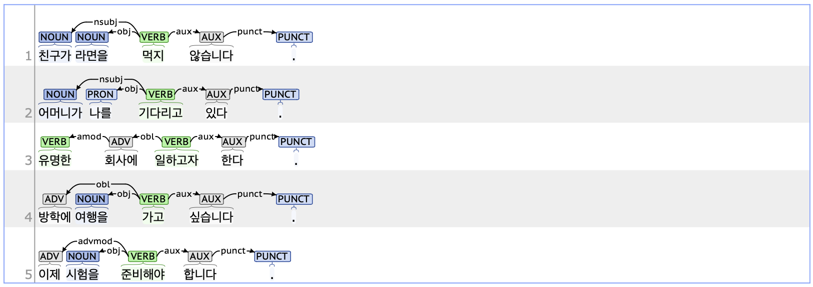

## aux: Auxiliary

### Definition
`aux` refers to auxiliary verbs that supplement the meaning of the head verb or adjective.

---

### Characteristics
- The aux tag is syntactically dependent on the head verb or adjective.  
- The aux tag applies to elements corresponding to VX (Verb_auxiliary, auxiliary verbs) in complex predicates such as '-지 않다', '-고 있다', '-고자 하다', and '-고 싶다'.
- **Examples**:  
    - 친구가 라면을 먹지 <ins>**않습니다**</ins>.  
    - 어머니가 나를 기다리고 <ins>**있다**</ins>.  
    - 유명한 회사에 일하고자 <ins>**한다**</ins>.  
    - 방학에 여행을 가고 <ins>**싶습니다**</ins>.  

---

### Boundary cases and clarifications

#### Differences with related tags
- **aux vs. advcl (Adverbial clause modifier):**  
  - Not all auxiliary verbs are tagged as aux. In the UD scheme, the aux tag is applied when auxiliary verbs such as '않다', '있다', '하다', and '싶다' function as auxiliary verbs.
  - Predicate expressions that include auxiliary verbs such as '게 되다' and '지 말다' are parsed as advcl. Like the aux tag, the advcl tag for auxiliary verbs depends on the preceding head predicates.
    - **aux**: 이제 시험을 준비해야 <ins>**합니다**</ins>.  
    - **advcl**: 이 소식을 가족에게 전하게 <ins>**되었다**</ins>.  

---

### Examples
