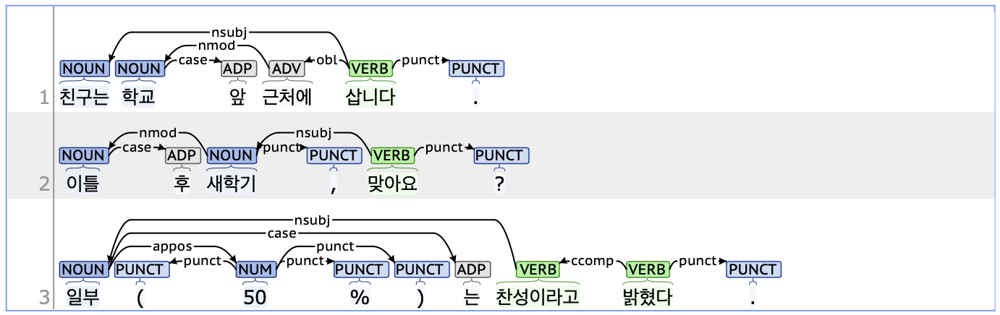

## case: Case marker

### Definition
`case` refers to a case marker that appears after a sentence element to indicate its grammatical role within a sentence.

---

### Characteristics
- The case tag generally appears as a preposition or postposition following pronouns, nouns, or noun phrases, and it functions as a dependent of these elements.
- In Korean, postpositions such as JKS (Postposition_nominative, 주격 조사) and JKO (Postposition_objectival, 목적격 조사), as well as auxiliary postpositions like JX (Postposition_auxiliary, 보조사), are typically attached to the preceding word. However, if these are incorrectly spaced, they should be parsed as case tags.
- **Examples**:
    - 학교 <ins>**앞에서**</ins> 친구를 기다립니다.
    - 이틀 <ins>**후에**</ins> 새 학기가 시작됩니다.
    - 저는 친구 <ins>**하고**</ins> 여행을 갈 예정입니다.
    - 일부(50%) <ins>**는**</ins> 찬성이라고 밝혔다.

---

### Boundary cases and clarifications
#### Differences with related tags
- **case vs. mark (Marker):**  
  - Not all case tags are formed with prepositions or postpositions. Both the case and mark tags can also consist of nouns, as they serve as function words that indicate the grammatical role of specific elements.
  - The case tag follows nouns directly, while the mark tag appears after predicates and introduces subordinate clauses.
    - **case**: 한 **시간**(obl) <ins>**후에**</ins> 식당에 도착합니다.
    - **mark**: 물을 한 컵 **마신**(advcl) <ins>**후에**</ins> 밥을 먹습니다.
  

#### Special cases
1. **VCP (Copular_positive, 긍정 지정사) as a case tag**
    - '이다' belongs to VCP, functioning as a predicate while also attaching to the preceding word like a postposition. If '이다' is incorrectly spaced from the preceding noun, it should be parsed as a case tag.
        - 빌리 씨는 미국사람 <ins>**이다**</ins>.
        - 매연은 환경 오염의 원인 <ins>**중**</ins> 하나 <ins>**이다**</ins>.
     
2. **Parsing '등' as a Case Marker**
    - In Korean, '등'(etc.) follows a list of two or more nouns, either limiting the referent to only those items or indicating that additional similar entities may exist.
    - Although '등' is categorized as an NNB (Noun_common_bound, dependent noun) in terms of part of speech, it is parsed as a case marker due to its typical placement after nouns and its role in indicating grammatical relationships between them.
      - 수요일에 국어, 수학, 체육 <ins>**등**</ins> 수업을 듣는다.
      - 산에서 진달래꽃, 개나리 <ins>**등을**</ins> 보니 자연이 참 좋다고 생각했습니다.

---

### Examples

