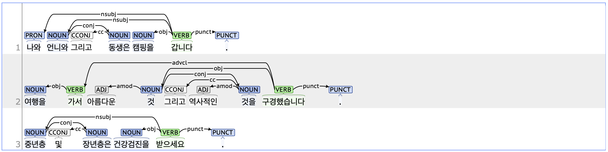

## cc: Coordinating conjunction

### Definition
`cc` refers to a coordinating conjunction that connects nouns or clauses of equal meaning.

---

### Characteristics
- The cc tag connects preceding nouns or clauses to following nouns or clauses, indicating coordination. When connecting nouns and noun phrases within a sentence, the cc becomes dependent on the following phrase. When connecting clauses at the beginning of a sentence, the cc depends on the root of the sentence.
- Examples tagged with cc include "그리고" (and), "그러나" (but), and "그런데" (however), among others.
- **Examples**:
    - 나, 언니와 <ins>**그리고**</ins> 동생은 캠핑을 갑니다.  
      (My sister, younger sibling, and I are going camping.)  
    - 가격이 비싸요. <ins>**그러나**</ins> 품질이 좋습니다.  
      (The price is high; however, the quality is good.)  
    - <ins>**그런데**</ins> 가장 인기가 많은 음식은 뭐예요?  
      (By the way, what is the most popular food?)

---

### Boundary cases and clarifications

#### Differences with related tags

- **cc vs. conj (coordinating conjunction):**
    - Both cc and conj tags appear in coordinated relationships between sentence elements.
    - The cc tag is used for words indicating a coordinating relationship, while the conj tag applies to coordinated words functioning as equals within a sentence.
        - 나 **그리고**(cc) **언니는**(conj) 여행을 갑니다.   
        - 중년층 **및**(cc) **장년층은**(conj) 건강검진을 받으세요.  

---

### Examples
