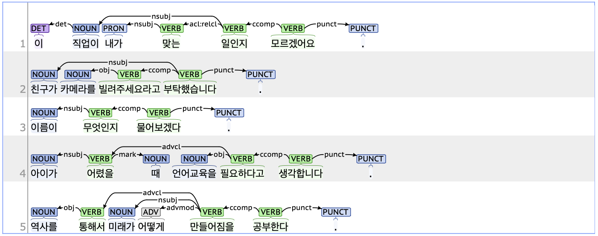

## ccomp: Clausal complement

### Definition
`ccomp` refers to a clausal complement that functions as a core argument within a sentence, excluding the subject.

---

### Characteristics
- The ccomp tag is typically used to parse the predicate of a clause that functions as an essential component of the sentence, such as an object or quotation.
- In clauses indicating quotations, the ccomp tag is often composed with JKQ (Postposition_quotative, 인용격 조사).
- **Examples**:
    - 이 직업이 내가 맞는 **일인지** 모르겠어요.
    - 친구가 카메라를 빌려 **주세요** 라고 부탁했습니다.

---

### Boundary cases and clarifications

#### Differences with related tags
- **ccomp vs. csubj (Clausal subject):**  
    - Both ccomp and csubj lead clauses that function as core arguments within a sentence.
    - The main parts of a sentence depend on its structure, but the subject is always important. If a clause is necessary for the sentence, the predicate is tagged as csubj if it acts as the subject. If it doesn't act as the subject, it's tagged as ccomp.
        - **ccomp**: 이름이 **무엇인지** 물어보겠다.
        - **csubj**: 처음에 한국어를 **발음하기가** 어려웠다.

---

### Examples

