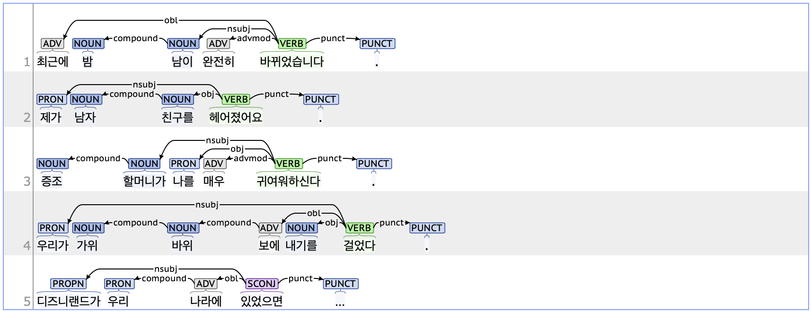

## compound: Compound

### Definition
`compound` refers to a part of a compound word that is written separately, even though it is treated as a single word in dictionaries.

---

### Characteristics
- In Korean, compound words are generally written without spaces. When a compound noun, verb, or other word is written with a space between its components, the elements tagged with compound should be parsed as dependent on the following element.
- **Examples**  
  - 최근에 **밤 낮** (*밤낮)이 완전히 바뀌었습니다.  
  - **증조 할머니** (*증조할머니)가 나를 매우 귀여워하신다.  
  - 학생들이 스마트폰을 **돌려 받았다** (*돌려받다).
  - 계단을 **오르** 내리는 (*오르내리다) 것은 확실히 운동이 됩니다.

---

### Examples

