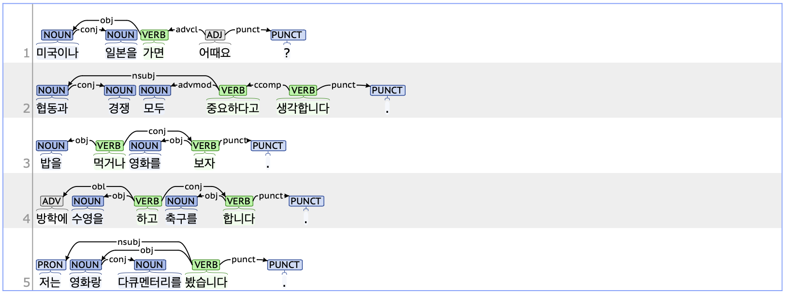

## conj: Conjunct

### Definition
`conj` refers to words that are coordinated as equals within a sentence, either between sentence elements or clauses.

---

### Characteristics
- The conj tag applies to words that are syntactically equivalent and linked as equals within a coordinated structure. The conj tag is dependent on the preceding element with which it shares an equal relationship.  
- When conj is tagged on nouns within a sentence, the coordination is typically marked by JC(Postposition_conjunctive, 접속 조사) such as ‘와/과’. When conj is tagged on predicates, the coordination is generally indicated by EC(Ending_connecting, 연결 어미) such as ‘고’ or ‘-(으)나’.
- **Examples**:
    - 미국이나 <ins>**일본을**</ins> 가면 어때요?  
    - 협동과 <ins>**경쟁**</ins> 모두 중요하다고 생각합니다.  
    - 밥을 먹거나 영화를 <ins>**보자**</ins>.  
    - 방학에 수영을 하고 축구를 <ins>**합니다**</ins>.  

---

### Boundary cases and clarifications
#### Differences with related tags
- **conj vs. flat (Flat expression):**  
    - Both the conj and flat tags apply to nouns in an equal relationship, with both tags depending on the preceding noun that is equally related to the tagged noun.
    - While conj is typically used when nouns are connected by postpositions such as ‘와/과’, ‘하고’, '(이)나’, or ‘(이)랑’, the flat tag is generally applied when nouns are listed consecutively without connectors.
        - **conj**: 저는 영화랑 <ins>**다큐멘터리를**</ins> 봤습니다.  
        - **flat**: 김 <ins>**선생님이**</ins> 오셨습니다.  

---

### Examples
