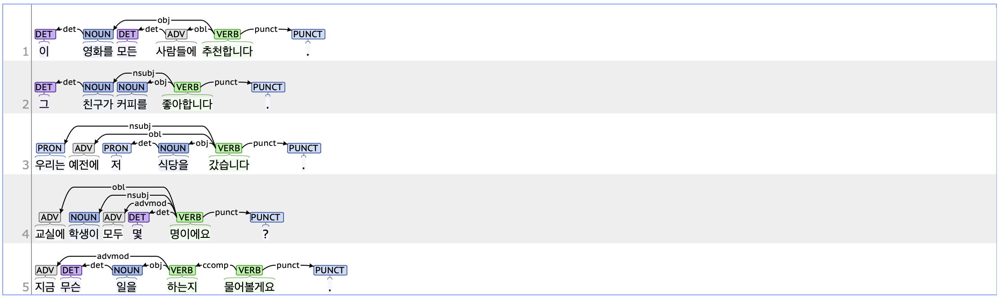

## det: Determiner

### Definition
`det` refers to a determiner that is placed before a noun to specify or quantify that noun.

---

### Characteristics
- The det tag modifies a noun and typically depends on the following noun.
- The det tag generally consists of MM(Determiner, 관형사). Common examples of MM tagged as det include 'demonstrative determiners' such as '이(this)', '그(that)', and '저(that)', as well as MM that limit the quantity of a noun, such as '모든(every)' and '몇(some/few)'.
- **Examples**:
    - <ins>**이**</ins> 영화를 <ins>**모든**</ins> 사람들에 추천합니다.  
    - <ins>**그**</ins> 친구가 커피를 좋아합니다.  
    - 우리는 예전에 <ins>**저**</ins> 식당에서 만났습니다.

---

#### Differences with related tags

- **det vs. nummod (Numeric modifier):**  
    - Both the det and nummod tags can be composed of determiners. However, the det tag limits the meaning of a noun in terms of quantity, whereas the nummod tag is composed of numeral determiners that indicate a specific number.  
        - **det:** 교실에 학생이 <ins>**몇**</ins> 명 있습니까?  
        - **nummod:** 교실에 <ins>**일곱**</ins> 명이 있습니다.

---

### Examples

