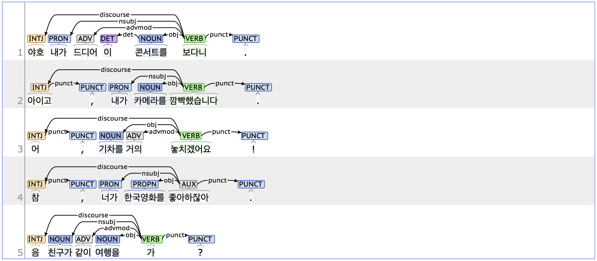

## discourse: Discourse element

### Definition
`discourse` refers to discourse elements that do not fit neatly into the syntactic structure of a sentence and express various speaker attitudes or emotions.

---

### Characteristics
- The discourse tag typically appears at the beginning or end of a sentence and is dependent on the root of the sentence.
- - The discourse tag is often assigned to interjections that are syntactically independent of the main clause. It applies not only to expressions conveying emotions like surprise or urgency but also to habitual conversational expressions such as '음' or '참', whose meaning varies by context.
- **Examples**  
    - <ins>**야호**</ins>, 내가 드디어 이 콘서트를 보다니.  
    - <ins>**참**</ins>, 넌 한국영화를 좋아하잖아.  
    - 부끄러워도 계속 발표하는 연습을 해봐야지, <ins>**뭘**</ins>.

---

### Examples
