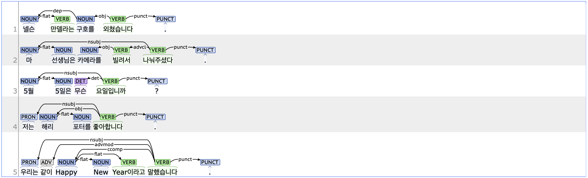

## flat: Flat multiword expression

### Definition
`flat` refers to flat multiword expressions that together function as a single syntactic unit.

---

### Characteristics
- The flat tag is typically applied to sequences of fixed expressions such as proper names, titles, dates, and foreign phrases.
- Words within a flat structure do not exhibit typical modifier-head relationships. The head of the flat structure is usually the first element, with subsequent elements dependent on it.
- **Examples**:
    - 넬슨 <ins>**만델라는**</ins> 포기하지 말라고 외쳤습니다.
    - 마 <ins>**선생님은**</ins> 카메라를 빌려서 나눠주셨다.
    - 5월 <ins>**5일은**</ins> 무슨 요일입니까?

---

### Boundary cases and clarifications

#### Differences with related tags
- **flat vs. appos (Appositional modifier):**  
    - Both flat and appos indicate relationships between noun phrases. However, the key difference lies in their semantic and structural dependence.
    - Removing an element from a fixed expression marked with flat changes the meaning or renders the expression ungrammatical. In contrast, removing an element marked with appos reduces information but does not alter the core meaning.
    - In a flat structure, the second noun typically depends on the preceding noun. In an appos structure, the dependent noun can appear either before or after the head noun, depending on the sentence structure.
        - 저는 **영화**(appos) 해리 **포터를**(flat) 좋아합니다.
        - 2월 **24일**(flat) (**월**(appos))에 여행 갈 계획이 있다.

---

### Examples

