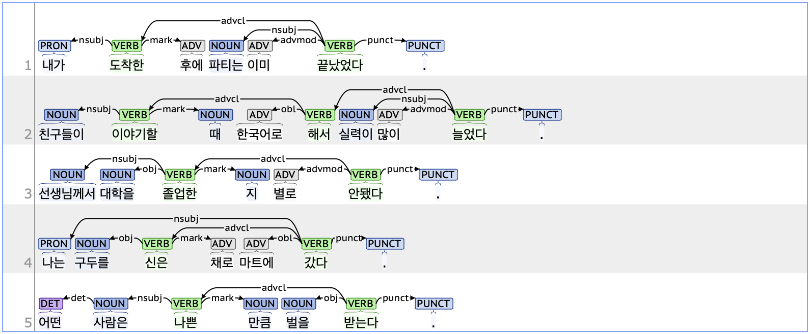

## mark: Marker

### Definition
`mark` refers to a function word that makes one clause subordinate to another.

---

### Characteristics
- The mark tag is typically dependent on the preceding advcl (Adverbial clause modifier).
- In the 'advcl + mark' structure, the advcl usually contains an ETM (Ending_Determinitive, 관형형 전성 어미), while the mark typically includes an NNB (Noun_common_bound, 의존 명사). From a morphological perspective, the verb or adjective in the advcl modifies the noun in the mark. From a syntactic perspective, the mark tag serves a grammatical function that allows the advcl to be subordinated to another clause.
- **Examples**:
    - 내가 **도착한**(advcl) **후에** 파티는 이미 끝났었다.
    - 발표가 **많다는**(advcl) **점에서** 시간이 빨리 갑니다.
    - 친구들이 **이야기할**(advcl) **때** 한국어로 해서 실력이 많이 늘었다.

---

### Examples

