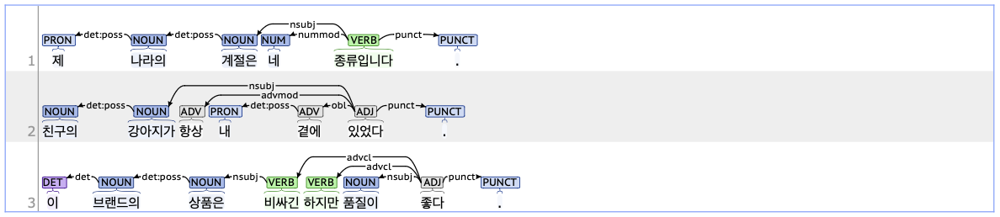

## nmod: nominal modifier

### Definition
`nmod` refers to a nominal modifier that specifies, qualifies, or describes a noun within a sentence.

---

### Characteristics
- The nmod tag typically appears before the noun it modifies and is syntactically dependent on that noun. The nmod tag provides additional information, such as attributes or specifications related to the modified noun.
- **Examples**:
    - 방학 전에 <ins>**여행**</ins> 계획을 세웠다.
    - <ins>**우리**</ins> 학교에 <ins>**학생**</ins> 식당이 있습니다.
    - <ins>**토요일**</ins> 아침에 출발하는 <ins>**비행기**</ins> 표를 예매했습니다.

---

### Boundary cases and clarifications
#### Differences from related tags
- **nmod vs. flat (Flat expression):**  
    - Both the nmod and flat tag refers to nouns in a sequence, but they differ in their syntactic relationship. When parsed as nmod, one noun modifies another, indicating a dependent relationship. In contrast, when parsed as flat, the nouns are in an equal, coordinate relationship.
        - 빌리 **씨는**(flat) **친구**(nmod) 카메라를 빌렸다.
        - 6월 **15일에**(flat) 출발하는 **여행사**(nmod) 상품을 신청했습니다.

---

### Examples

## nmod:poss: possessive modifier

### Definition
`nmod:poss` refers to a subtype of nominal modifier that emphasizes a possessive relationship between nouns.

---

### Characteristics
- The dependent noun tagged with nmod:poss modifies the head noun, specifying possession, ownership, or association.
- The nmod:poss tag is most commonly marked by JKG(Postposition_prenominal, 관형격 조사) such as '의'.
- **Examples**:
    - 오늘은 <ins>**친구의**</ins> 생일입니다.
    - <ins>**한국의**</ins> 화장품을 자주 사용합니다.

---

### Examples

In the examples, `det:poss` indicates the function of `nmod:poss`.