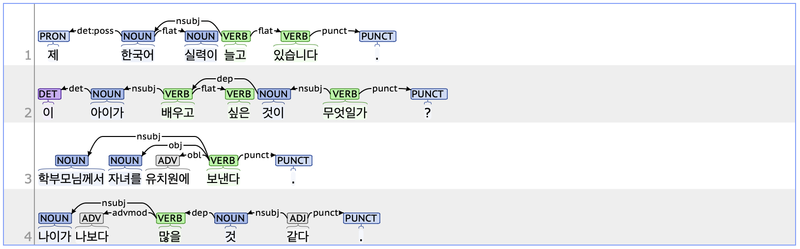

## nsubj: Nominal subject

### Definition
`nsubj` refers to a nominal subject, one of a core arguments that serves as the agent or experiencer of the action or state described by the predicate.

---

### Characteristics
- In Korean, the nsubj is often omitted when it is contextually clear.
- The nsubj tag typically includes the case marker JKS(Postposition_nominative, 주격 조사), such as '이/가' or '께서'.
- **Examples**:
  - 제 한국어 **실력이** 늘고 있습니다.
  - 이 **아이가** 배우고 싶은 **것이** 무엇일까?
  - **학부모님께서** 자녀를 유치원에 보낸다.

---

### Boundary cases and clarifications

#### Differences with related tags
- **nsubj vs. csubj (Clausal subject):**  
  - nsubj is used for nouns or noun phrases that act as the subject, while csubj is used when a whole clause serves as the subject.
  - If a csubj clause has its own subject inside it, both tags may be applied.
    - **nsubj**: **결과가** 좋다.
    - **csubj**: **결과가**(nsubj) **좋을지** 의문이다.

#### Special cases
1. **Parsing complements**
  - In Korean, JKC (complement case marker) looks the same as JKS (subject case marker), like '이/가'. So, the nominal complement in a sentence is tagged as nsubj.
    - 그 사람이 **부자가** 되었다.
    - 나는 **학생이** 아니다.

2. **'것 같다' construction**  
  - The phrase '것 같다' is a predicate phrase used to express conjecture or assumption. Grammatically, '것' is classified as NNB (a bound noun), and **'같다'** as VA (an adjective). Since they are always written separately, '같다' is annotated as the root, and '것' is tagged as nsubj because it functions similarly to a subject.
    - 도서관에서 심심했을 **것** 같다.
    - **나이가** 나보다 많을 **것** 같다.

3. **Case marker criteria for nsubj**
  - In ungrammatical sentences, an element with JKS (e.g., '이/가') is tagged as nsubj, even if it is not the logical subject.  
  - If there is no case marker, the subject is identified based on context and tagged as nsubj.
  - This rule applies to all major syntactic components that are usually marked by case markers in Korean. Since case markers are essential in Korean syntax, this approach helps prevent subjective tagging.
    - 그 날의 **기억이**(*기억을) 떠올려 보세요.
    - **제가** **친구가** 선물을 주었습니다.

---

### Examples

