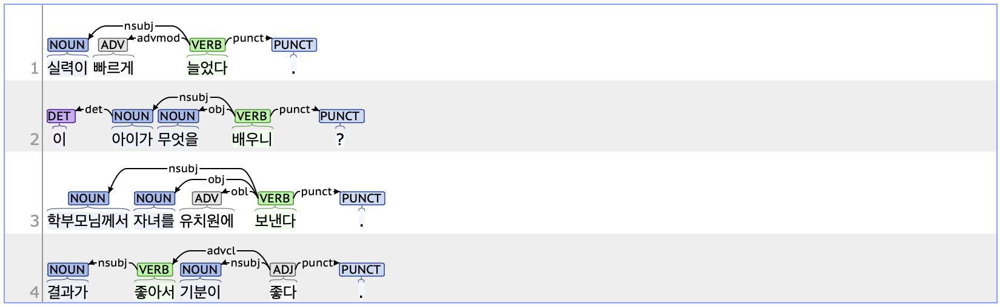

## nsubj: Nominal subject

### Definition
`nsubj` refers to the nominal subject, one of the core arguments that serves as the agent or experiencer of the action or state described by the predicate.

---

### Characteristics
- In Korean, the nsubj is often omitted when it is contextually clear.
- The nsubj tag typically includes the case marker JKS(Postposition_nominative, 주격 조사), such as '이/가' or '께서'.
- **Examples**:
  - 제 한국어 <ins>**실력이**</ins> 늘고 있습니다.
  - 이 <ins>**아이가**</ins> 배우고 싶은 <ins>**것이**</ins> 무엇일까?
  - <ins>**학부모님께서**</ins> 자녀를 유치원에 보낸다.

---

### Boundary cases and clarifications
#### Differences with related tags
- **nsubj vs. csubj (Clausal subject):**  
  - While nsubj is used to annotate nouns or noun phrases, csubj is used when an entire clause within a sentence functions as the subject. In some cases, both tags may be applied if the clause functioning as csubj contains an internal nsubj.
  - **nsubj**: <ins>**결과가**</ins> 좋다.
  - **csubj**: **결과가**(nsubj) <ins>**좋을지**</ins> 의문이다.

#### Special cases
1. **"것 같다" construction**  
   - The phrase "것 같다" is a predicate that expresses conjecture or assumption. Grammatically, '것' is classified as NNB (Noun_common_bound, 의존 명사), and '같다' as VA (Adjective, 형용사). Since they are always written separately, when '같다' is annotated as root, the role of '것' is tagged as nsubj.
     - 도서관에서 심심했을 <ins>**것**</ins> 같다.
     - <ins>**나이가**</ins> 나보다 많을 <ins>**것**</ins> 같다.

2. **Case marker criteria for nsubj**
   - For ungrammatical sentences, the element marked with JKS (e.g., '이/가') is tagged as nsubj even if it does not serve as the logical subject.
   - When there is no case marker, the element functioning as the subject based on context is tagged as nsubj.
   - This criterion is applied to all major syntactic components typically marked by case markers in Korean. Since case markers play a crucial role in Korean syntax, this approach minimizes the risk of assigning tags based on subjective interpretation.
     - 이야기를 하면서 <ins>**기억이(*기억을)**</ins> 떠올려 보세요.
     - <ins>**제가**</ins> <ins>**친구가**</ins> 선물을 주었습니다.

---

### Examples

