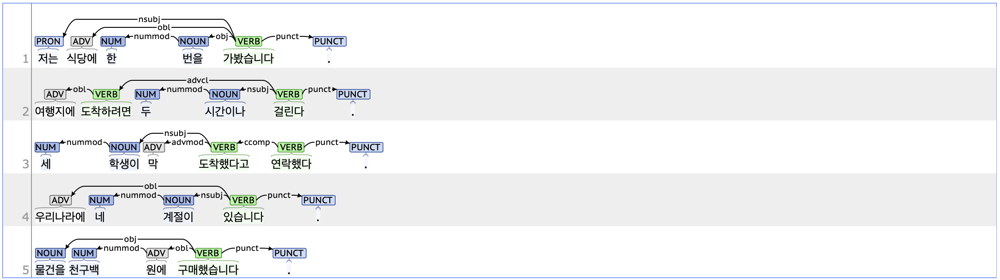

## nummod: Numeric modifier

### Definition
`nummod` refers to a numeric modifier that is placed before a noun to provide information about the quantity or size of the noun.

---

### Characteristics
- The nummod tag modifies a noun and typically depends on the following noun.
- The nummod tag typically consists of MM (Determiner, 관형사). Common examples of MM tagged as nummod include numerical determiners such as '한' (one), '두' (two), and '세' (three).
- Words with the nummod tag are often followed by unit nouns.
- **Examples**
  - 저는 식당에 **한** 번을 가봤습니다.
  - 여행지에 도착하려면 **두** 시간이나 걸린다.
  - **세** 학생이 막 도착한다고 연락했다.

---

### Examples

