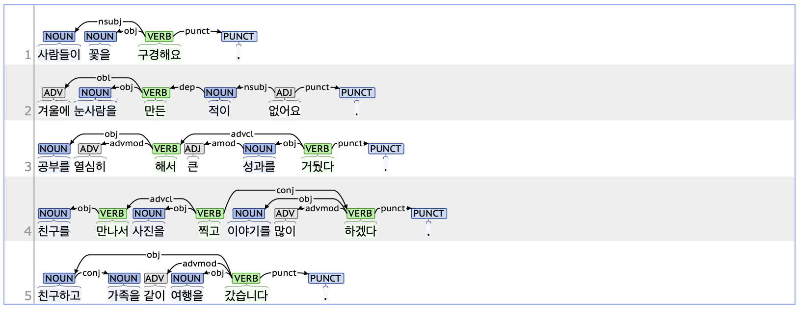

## obj: Object

### Definition
`obj` refers to the object, which is one of the core arguments in a sentence with a transitive verb. It denotes the noun or noun phrase that serves as the target of the action.

---

### Characteristics
- Korean generally follows an SOV (subject-object-verb) word order.
- The obj tag typically includes the case marker JKO (Postposition_objectival, 목적격 조사), such as '을/를.'
- In sentences composed of multiple clauses with different objects, the role of the word tagged as obj is determined by the predicate it depends on.

- **Examples**:
    - 사람들이 **꽃을** 구경해요.
    - 겨울에 **눈사람을** 만들었다.
    - **공부를** 열심히 해서 큰 **성과를** 거뒀다.
    - **친구를** 만나서 **사진을** 찍고 **이야기를** 많이 하겠다.

---

### Boundary cases and clarifications

#### Special cases
- **Case marker criteria for obj:**  
   - For ungrammatical sentences, since case markers play a crucial role in Korean syntax, the element marked with JKO is tagged as obj even if it does not serve as the logical object.
        - **단풍을**(*단풍이) 피었습니다.
        - 방학 때  **가족을**(*가족과) 같이 **여행을** 갔습니다.

---

### Examples

