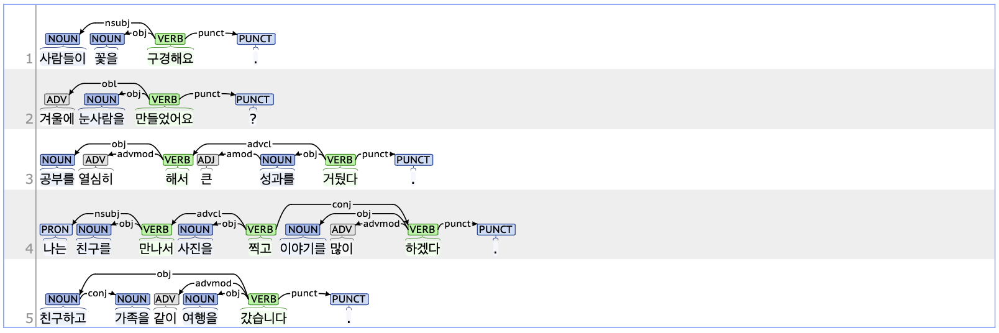

## obj: Object

### Definition
`obj` refers to the object, which is one of the core arguments in a sentence with a transitive verb. It denotes the noun or noun phrase that serves as the target of the action.

---

### Characteristics
- Korean generally follows an SOV (subject-object-verb) word order.
- The obj tag typically includes the case marker JKO (Postposition_objectival, 목적격 조사), such as '을/를.'
- In sentences composed of multiple clauses with different objects, the role of the word tagged as obj is determined by the predicate it depends on.

- **Examples**:
    - 사람들이 <ins>**꽃을**</ins> 구경해요.
    - 겨울에 <ins>**눈사람을**</ins> 만들었다.
    - <ins>**공부를**</ins> 열심히 해서 큰 <ins>**성과를**</ins> 거뒀다.
    - <ins>**친구를**</ins> 만나서 <ins>**사진을**</ins> 찍고 <ins>**이야기를**</ins> 많이 하겠다.

---

### Boundary cases and clarifications

#### Special cases
- **Case marker criteria for obj:**  
   - For ungrammatical sentences, since case markers play a crucial role in Korean syntax, the element marked with JKO (e.g., '을/를') is tagged as obj even if it does not serve as the logical object.
        - <ins>**단풍을**</ins>(*단풍이) 피었습니다.
        - <ins>**친구하고**</ins> 가족을(*가족과) 같이 <ins>**여행을**</ins> 갔습니다.

---

### Examples
