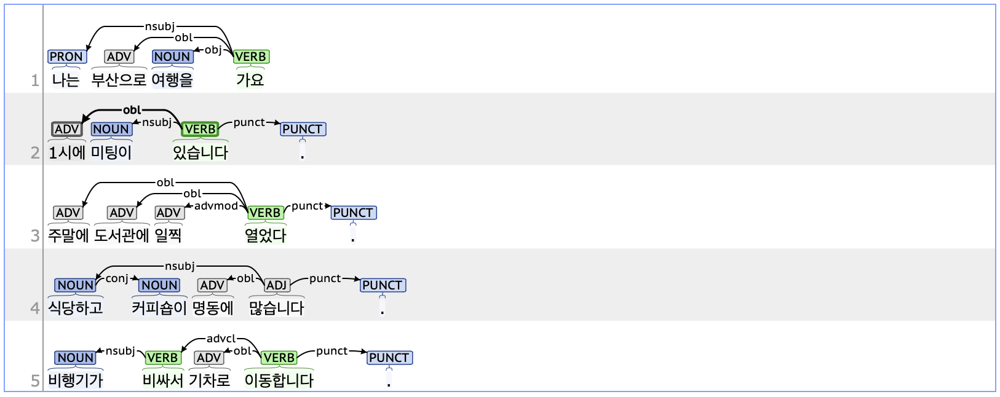

## obl: Oblique nominal adverbial

### Definition
`obl` refers to a nominal adverb that functions as a sentence component modifying the predicate.

---

### Characteristics
- The obl tag is typically composed of noun + JKB (Postposition_adverbial, 부사격 조사), such as '에게', '에서', '한테', '에', '(으)로', and '께'.
- The obl tag provides additional information about direction, time, location, manner, or cause.
- **Examples**:
    - 나는 <ins>**부산으로**</ins> 여행을 가요.
    - <ins>**1시에**</ins> 미팅이 있습니다.
    - 우리는 바다 <ins>**근처**</ins>에서 식사를 했습니다.
    - 비행기가 비싸서 <ins>**기차로**</ins> 이동합니다.

---

### Boundary cases and clarifications
#### Differences with related tags
- **obl vs. advmod (Adverbial modifier):**  
    - Both the obl and advmod tags function as adverbials within a sentence. From a part-of-speech perspective, the obl tag generally includes a noun, whereas the advmod tag typically consists of either adverbs or verb stems combined with the suffix '-게'.
    - Some Korean words such as '어제' and '오늘' can function as both nouns and adverbs, allowing for both obl and advmod tagging depending on the context.
        - **obl**: <ins>**기차로**</ins> 이동합니다.
        - **advmod**: <ins>**천천히**</ins> 이동합니다.

- **obl vs. conj (Conjunct):**  
    - The obl tag functions to limit or specify the content of the predicate within a sentence, whereas the conj tag indicates a relationship of equality with another word or phrase in the sentence.  
    - The obl is generally dependent on the root tag of the sentence or clause, while the conj tag relies on a specific word with which it holds an equal relationship.
        - **obl**: <ins>**친구하고**</ins> <ins>**커피숍에**</ins> 왔습니다.
        - **conj**: <ins>**식당하고**</ins> 커피숍이 명동에 많습니다.

#### Special cases
- **Nouns accompanied by prepositional words:**  
    - When a noun is accompanied by a word functioning as a preposition, that noun is typically parsed as obl. Examples of such words in Korean  include '앞' (in front of), '옆' (beside), '뒤' (behind), '전' (before), and '후' (after).
        - <ins>**학교**</ins> 앞에서 친구를 기다린다.
        - 식사를 <ins>**마치기**</ins> 전에는 먼저 일어나면 안 됩니다.

---

### Examples

