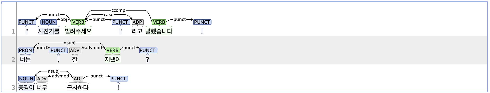

## punct: Punctuation

### Definition
`punct` refers to punctuation marks such as SF (Period, Question Mark, Exclamation Mark), SE (Ellipsis), SS (Quotation Mark, Bracket, Dash), SP (Comma, Colon, Slash), and SO (Hyphen, Swung Dash) when used independently.

---

### Characteristics
- The punct tag does not establish syntactic relations but contributes to sentence structure, disambiguation, and readability.
- The punct tag is typically used at the end of a sentence and depends on the root of the sentence. When used in the middle of a sentence, it may depend on the preceding or following unit depending on the context. For example, paired punctuation marks such as quotation marks depend on the unit that serves as the root within the quoted sentence.
- **Examples**:
    - 빌리씨 **,** 잘 지냈어요 **?**
    - **"** 사진기를 빌려주세요 **"** 라고 부탁했다 **.**
    - 설문조사 결과에서 응답자의 50 **%** 가 만족했습니다 **.**
---

### Examples
