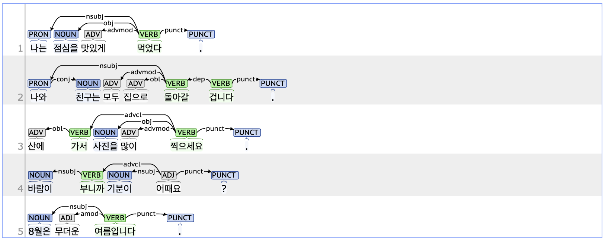

## root: Root

### Definition
`root` refers to the core syntactic head of a sentence. It is usually a predicate, such as a verb or an adjective, that expresses the subject’s action, state, or quality.

---

### Characteristics
- The root tag represents an essential component of a sentence. It is generally found at the end of a sentence in the form of a verb, adjective, or copula combined with EF (Ending_Closing, 종결 어미).
- The root tag is the central element to which all other words in the sentence connect, either directly or indirectly. When there is ambiguity regarding the syntactic dependency of a sentence component, the default principle is to make it dependent on the root.
- **Examples**:
  - 나는 점심을 맛있게 **먹었다**.
  - 나와 친구는 모두 집으로 돌아갈 **겁니다**.
  - 산에 가서 사진을 많이 **찍으세요**.
  - 바람이 부니까 기분이 **어때요**?

---

### Boundary cases and clarifications

#### Special cases
1. **Coordinated clauses**
  - When two or more clauses within a sentence are connected in a sequential, contrasting, or alternative relationship, the first predicate is parsed as the root, while the others are tagged as conj (Conjunct) dependent on the root.
  - If conj is dependent on the root, the root tag typically includes EC (Ending_Connecting, 연결 어미) such as '-고', '-(으)며', or '-(으)나'.
    - 방학 때 수영을 **했고**(root) 말도 **탔습니다요**(conj).
    - 사진을 **찍거나**(root) 꽃을 **구경해요**(conj).

2. **Copular constructions with '이다'**
  - '이다' is the representative VCP (Copular_Positive, 긍정 지정사). Unlike general lexical verbs, VCP does not carry an independent meaning. Therefore, it must be attached to the preceding word to form a grammatically and semantically correct phrase.
  - However, in non-standard sentences, '이다' is sometimes separated from the preceding word. In such cases, the word before '이다' is parsed as the root, while '이다' is tagged as a case (Case marker) that marks the root.
    - 8월은 무더운 **여름**(root) **입니다**(case).
    - 주장에 대한 근거는 세 **가지**(root) **이다**(case).

---

### Examples

